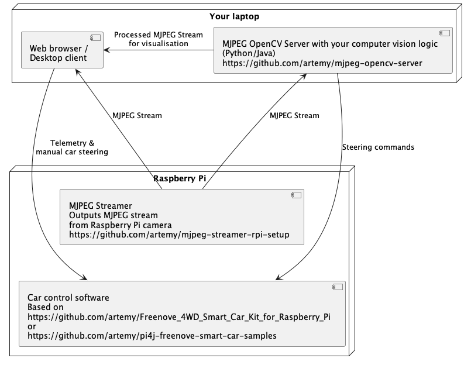

# MJPEG OpenCV Server

This project contains two demos of a server OpenCV reading a remote MJPG stream, applying processing and outputting result as another MJPG stream.

- [Java Demo](mjpeg-opencv-server-java)
- [Python Demo](mjpeg-opencv-server-python)

## Proposed architecture

